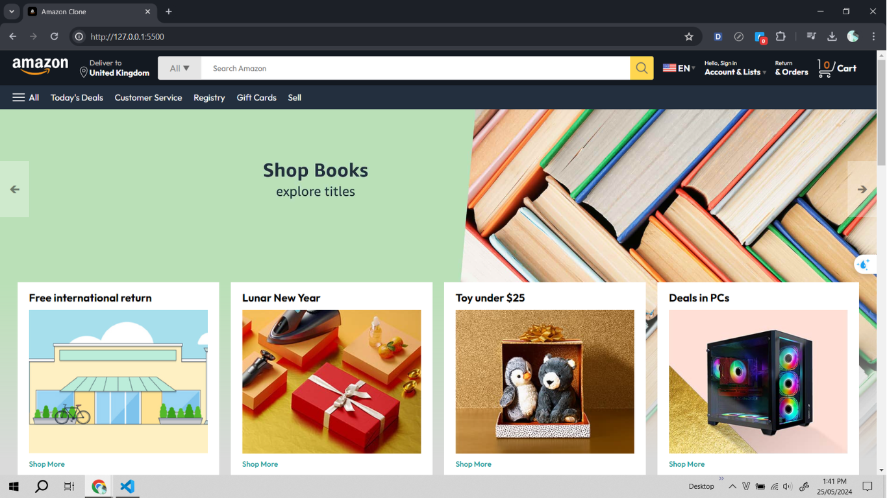
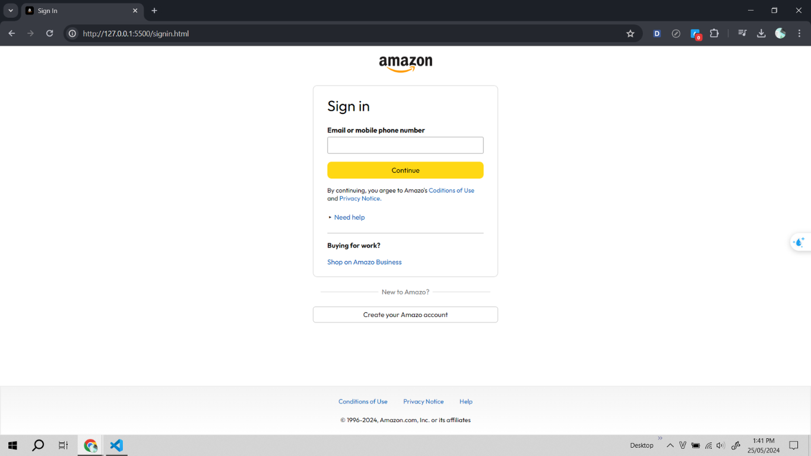
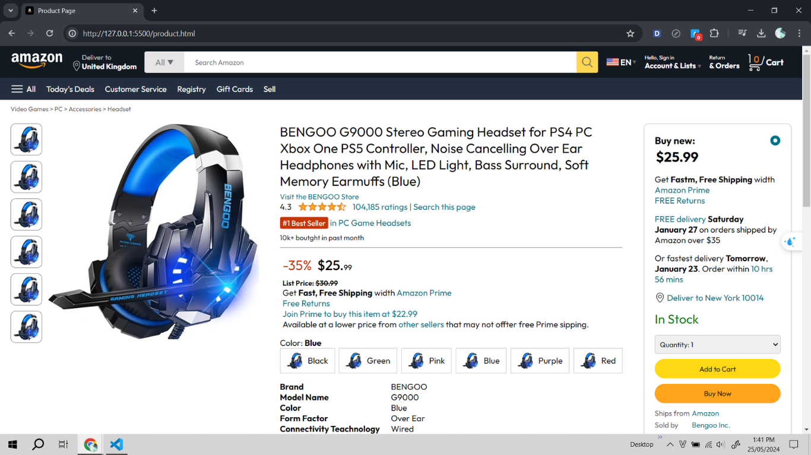
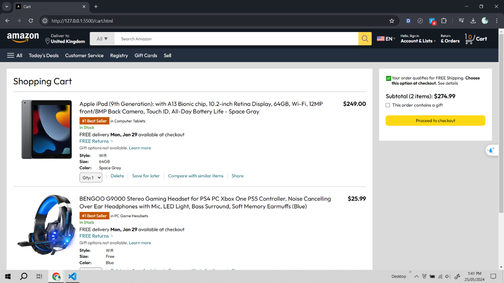
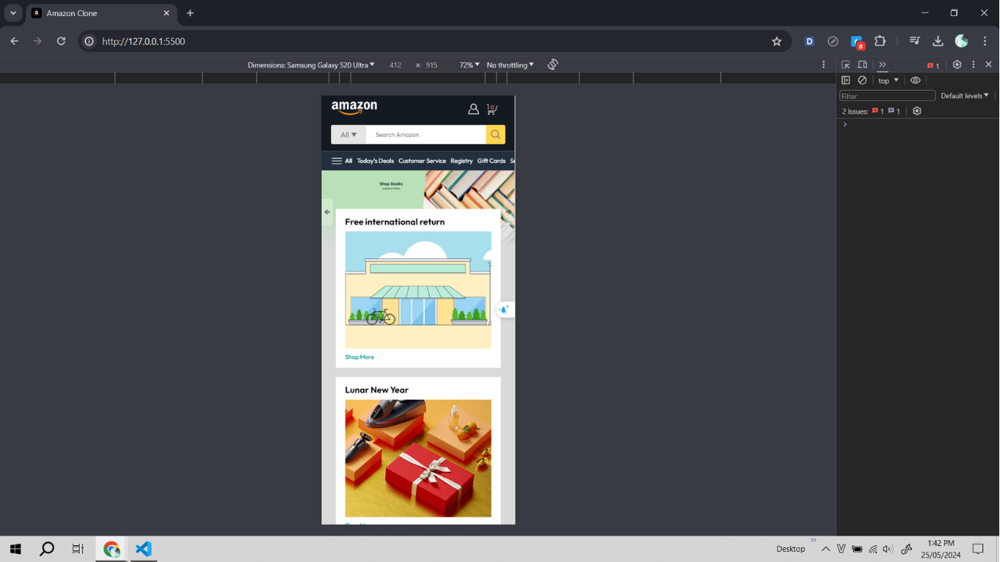

# Amazon Clone

A fully responsive Amazon clone website built with modern web technologies. This project replicates the core functionalities of the Amazon website, including user registration, product detail pages, and a dynamic shopping cart. The design adapts seamlessly across devices, offering an optimized user experience on both mobile and desktop platforms.

## Features

- **Home Page**: Showcasing featured products and categories.
- **User Registration**: Secure sign-up and sign-in functionality.
- **Product Detail Pages**: Detailed product descriptions with pricing and reviews.
- **Shopping Cart**: Interactive cart system allowing users to add, remove, and view items.
- **Responsive Design**: Optimized for all screen sizes, ensuring usability on mobile, tablet, and desktop.

## Preview

### Trang chủ

### Trang đăng ký

### Trang chi tiết sản phẩm

### Trang giỏ hàng

### Responsive Design

## Live Demo

Check out the live version of the project here: [Live Demo](https://nguyenvanduydev001.github.io/amazon-clone/)

---

Feel free to explore the code and experience the functionalities live by cloning this repository.
